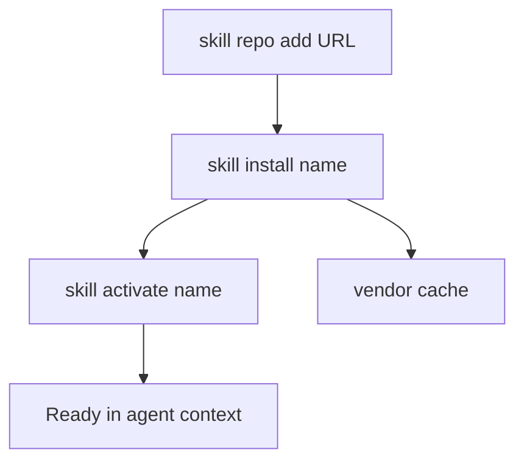

**English** | [Русский](../ru/skill-ecosystem.md)

# Skill ecosystem — one-page map

Single entry point for **vendor / repo skills** (not the 13 core slash skills in `agents/skills/` — those ship with TAUSIK and are documented in **[Skills](skills.md)**).

## Flow (install path)

**CLI steps** (mirror of [CLI — Skills](cli.md#skills); run via `.tausik/tausik`):

1. **`skill repo add <url>`** — register a TAUSIK-compatible repo (`tausik-skills.json` / legacy `skills.json`).
2. **`skill install <name>`** — clone if needed, copy skill files, install declared pip dependencies.
3. **`skill activate <name>`** — promote an installed skill into the IDE skill load path (see [Vendor skills — three tiers](vendor-skills.md#three-tier-skill-system)).
4. **`skill list`** — see active, vendored, and available skills.

**Deactivate / remove:** `skill deactivate <name>` · `skill uninstall <name>` · `skill repo remove <name>` (see CLI reference).

## Risks

- **`skill repo add`** without **`--force`** only succeeds for the official **Kibertum/tausik-skills** URL; third-party repos require an explicit opt-in after review ([Vendor skills — Repo trust](vendor-skills.md#repo-trust-force)).
- External repos run **arbitrary instructions** in `SKILL.md` and may execute scripts during install. Treat unknown repos like untrusted code. Details: **[Vendor skills](vendor-skills.md)** (security & trust).
- **Context budget:** each *active* skill consumes prompt space; keep only frequently used skills activated.

## Where to go next

| Topic | Document |
|-------|----------|
| Repo format, pip deps, `tausik-skills.json` | [Vendor skills](vendor-skills.md) |
| Slash skills `/plan`, `/ship`, core 13 | [Skills](skills.md) |
| IDE-specific skill paths | [Skill adaptation](skill-adaptation.md) |
| MCP tool names for agents | [MCP](mcp.md) — `tausik_skill_*` |
