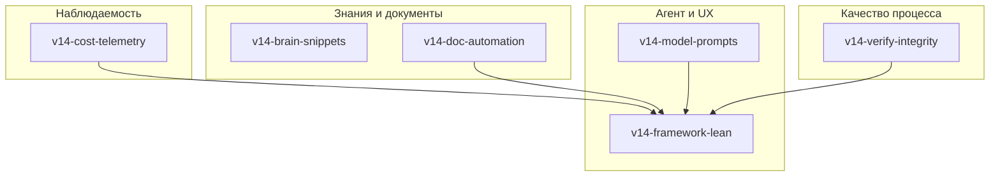

# TAUSIK 1.4 — мастер-план эпиков

**Цель документа:** зафиксировать **полную декомпозицию** дополнительного бэклога версии 1.4 так, чтобы по каждой теме можно было завести **отдельный эпик**, внутри — **сторисы** и **атомарные задачи** с понятными AC и зависимостями.

**Статус импорта в `.tausik/tausik.db`:** выполнено (2026-05-01): **10 эпиков**, **28 сторис**, **35 задач** в статусе `planning` (префикс `v14-`), у каждой задачи заданы **`goal`** и **`acceptance_criteria`** (в AC есть формулировки **Negative / ошибка / отклоняется / fail** для **QG-0**). Поля **`scope`**, **`scope_exclude`**, **`call_budget` / `tier`** при создании не заполнялись — при **`task start`** разумно дописать их под конкретную доработку (SENAR).

**Handoff для нового агента**

1. Прочитать приоритеты: раздел «Приоритизация» (P0: `v14-verify-integrity`, `v14-framework-lean`).
2. Очередь: `tausik task list --status planning` или `tausik task next`.
3. Карточка задачи: `tausik task show <slug>` — там title, story, goal, AC.
4. Маршрут работы: `task_start` → работа → `verify` (при изменении кода) → `task_done` (см. Verify-First в `docs/ru/mcp.md`).
5. Контекст дорожек: таблицы задач по эпикам ниже в этом файле; связь **эпик → сторис → задачи** соответствует столбцу story в `task list`.

**Как использовать**

1. Утвердить приоритет эпиков (раздел «Приоритизация»).
2. Эпики/сторис/задачи уже созданы — брать работу через `tausik task list --status planning` или `tausik task next`.
3. Для новых задач вне этого плана: `tausik task add "..." --story <story_slug>`.

**Связь с прошлым релизным эпиком:** `rel-14-readiness` закрыт вместе с последними задачами readiness; новые эпики начинаются с префикса **`v14-`** (version 1.4 backlog), чтобы не смешивать с audit-fixes.

---

## Карта зависимостей (логическая)



**Смысл:** телеметрия стоимости и автоматизация доков **кормят** дорожку облегчения фреймворка; целостность verify — **ограничение сверху**, чтобы оптимизация не превратилась в обход гейтов.

---

## Приоритизация (рекомендация)

| Порядок | Эпик | Зачем первым |
|--------:|------|----------------|
| P0 | `v14-verify-integrity` | Доверие к QG-2 и verify-first — фундамент методологии |
| P0 | `v14-framework-lean` | Прямой ответ на «съедает контекст» — видимый UX-выигрыш |
| P1 | `v14-cost-telemetry` | Нельзя улучшать то, что не измеряешь |
| P1 | `v14-doc-automation` | Убирает постоянный дрейф чисел (96/97/104) и ручной труд |
| P2 | `v14-model-prompts` | Мульти-модельность уже реальность |
| P2 | `v14-test-philosophy` | Удерживает скорость CI и качество suite |
| P3 | `v14-brain-snippets` | Продуктовая фича Shared Brain |
| P3 | `v14-project-hygiene` | Нужна живым долгим проектам |
| P4 | `v14-skill-store` | UX каталога и доверие к внешним скиллам |
| P4 | `v14-dead-code-audit` | Большой шум в diff — лучше после стабилизации API |

Порядок можно менять, если продуктовый фокус — Brain или skill store.

---

# Эпик 1 — `v14-brain-snippets`

**Название:** Shared Brain: сниппеты и переиспользуемые артефакты  
**Проблема:** паттерны уровня RBAC повторяются между проектами, но «сырой код» без контекста и границ применимости вредит и безопасности, и поиску.  
**Исход:** агент и человек могут **явно** публиковать карточку артефакта (контракт, ограничения, ссылки), с минимальной связкой Notion ↔ локальное зеркало ↔ опциональный git-слой.

### Сторисы

| story_slug | Название |
|------------|----------|
| `v14-brain-snippets-model` | Модель данных и классификация артефактов |
| `v14-brain-snippets-workflow` | Поток «предложить → утвердить → переиспользовать» |
| `v14-brain-snippets-security` | Границы доверия и scrubber |

### Задачи (черновик)

| task_slug (черновик) | Заголовок | AC (направление) |
|---------------------|-----------|------------------|
| `v14-artifact-taxonomy` | Таксономия: artifact vs pattern vs snippet | Документ + поля в brain/notion или локальной схеме; негатив: отклонение без заголовка/категории |
| `v14-artifact-card-schema` | JSON/schema карточки артефакта | Валидация обязательных полей; негатив: пустой scope |
| `v14-artifact-publish-flow` | CLI/MCP: propose_artifact / publish | Запись с audit; негатив: отказ при classifier high-risk без подтверждения |
| `v14-artifact-search-ranking` | Поиск артефактов в brain_search | Релевантность по стеку; негатив: пустой запрос → понятная ошибка |
| `v14-artifact-external-repo` | (Опционально) ссылка на git submodule path | Документированный opt-in; негатив: битая ссылка ловится при publish |

**Риски:** фантазии модели о «универсальности» → обязательный human gate для публикации.

---

# Эпик 2 — `v14-model-prompts`

**Название:** Мульти-модельные промпты, профили и экономия токенов  
**Проблема:** один и тот же SKILL ведёт себя по-разному на Claude / GPT / др.; общие инструкции раздувают контекст.  
**Исход:** **ядро + профили** (или варианты секций), явное соглашение по выбору профиля; метрики токенов на задачу (см. эпик 4).

### Сторисы

| story_slug | Название |
|------------|----------|
| `v14-model-prompts-schema` | Формат профилей в skills и bootstrap |
| `v14-model-prompts-routing` | Выбор профиля по модели/IDE/env |
| `v14-model-prompts-autosuggest` | Рекомендации модели по типу задачи (без принуждения) |

### Задачи (черновик)

| task_slug | Заголовок | AC (направление) |
|-----------|-----------|------------------|
| `v14-skill-profile-format` | Спецификация frontmatter / `variants/` для skills | Документ + 1 демо-skill; негатив: неизвестный профиль → fallback |
| `v14-bootstrap-model-env` | Генерация `TAUSIK_MODEL_PROFILE` в `.tausik/config.json` | Опционально; негатив: невалидное значение → отказ |
| `v14-agents-md-multi-model` | Обновить AGENTS.md: таблица «модель → поверхность» | Согласовано с docs; негатив: устаревший счёт MCP ловится тестом drifts |
| `v14-task-next-model-hint` | (Опционально) подсказка модели в task_next/HUD | Feature-flag; негатив: не блокирует старт задачи |

**Зависимости:** пересекается с **`v14-framework-lean`** и **`v14-cost-telemetry`**.

---

# Эпик 3 — `v14-verify-integrity`

**Название:** Целостность Verify-First и anti-gaming QG-2  
**Проблема:** `auto_verify` и тестовые шимы легко спутать с «обманом»; нужно развести **допустимый CI/opt-out**, **тестовую изоляцию** и **анти-паттерны для агентов**.  
**Исход:** ясная политика в доках + опционально **`doctor`** предупреждает о рискованном сочетании настроек; `task_done` остаётся быстрым за счёт verify+cache.

### Сторисы

| story_slug | Название |
|------------|----------|
| `v14-verify-policy-docs` | Документация политики verify / auto_verify |
| `v14-verify-doctor-signals` | Сигналы в doctor для «подозрительных» конфигов |
| `v14-verify-conftest-clarity` | Комментарии/имена в тестах verify-first |

### Задачи (черновик)

| task_slug | Заголовок | AC (направление) |
|-----------|-----------|------------------|
| `v14-docs-verify-glossary` | EN/RU глоссарий: opt-out vs bypass vs shim | Один источник правды; негатив: противоречие между разделами → review checklist |
| `v14-doctor-auto-verify-hint` | doctor: предупреждение если auto_verify+interactive | Не failing по умолчанию; негатив: не ломает существующие проекты |
| `v14-conftest-verify-first-comment` | Уточнить docstring `_opt_out_verify_first` | Ссылка на `verify_first` marker; негатив: тест без маркера не ломает контракт |

**Зависимости:** опирается на уже внедрённый Verify-First из readiness ([аудит v2](tausik-1.4-readiness-audit-v2-2026-05-01.md)).

---

# Эпик 4 — `v14-cost-telemetry`

**Название:** Учёт токенов и «долларов» на задачу и дашборд  
**Проблема:** нет сводной экономики по задачам/эпикам; провайдеры отдают разные поля.  
**Исход:** **оценочные** метрики (токены ± тарифная таблица в конфиге), агрегаты по задаче/стори/сессии, команда CLI/HUD.

### Сторисы

| story_slug | Название |
|------------|----------|
| `v14-cost-schema` | Схема БД и события для usage |
| `v14-cost-ingest` | Сбор с IDE/хуков (где возможно) или ручной лог |
| `v14-cost-dashboard` | `metrics`/HUD расширение |

### Задачи (черновик)

| task_slug | Заголовок | AC (направление) |
|-----------|-----------|------------------|
| `v14-usage-events-schema` | Таблица `usage_events` или расширение events | Миграция + CRUD; негатив: отрицательные токены отклоняются |
| `v14-pricing-table-config` | `config.json`: тарифы по model_id | Валидация; негатив: неизвестная модель → estimate UNKNOWN |
| `v14-task-rollup-cost` | Агрегат по task_slug | Отчёт за период; негатив: пустой период → пустой отчёт без crash |
| `v14-metrics-cost-command` | `tausik metrics --cost` или флаг | Документировано; негатив: нет данных → понятное сообщение |

**Зависимости:** желательно раньше **`v14-framework-lean`**, чтобы измерить эффект оптимизаций.

---

# Эпик 5 — `v14-project-hygiene`

**Название:** Гигиена долгоживущего проекта (шум задач и знаний)  
**Проблема:** копятся done-задачи, дубли памяти, устаревшие записи.  
**Исход:** политики архивации, compaction, «TTL» для типов памяти, интеграция с существующими командами (`memory_compact`, RAG archive).

### Сторисы

| story_slug | Название |
|------------|----------|
| `v14-hygiene-policy` | Политика хранения и архивации |
| `v14-hygiene-automation` | Команды/хуки периодического обслуживания |

### Задачи (черновик)

| task_slug | Заголовок | AC (направление) |
|-----------|-----------|------------------|
| `v14-archive-done-tasks-spec` | Спека read-only архива done > N дней | Документ + параметры config; негатив: активная задача не трогается |
| `v14-memory-dedupe-guidelines` | Гайд «когда merge vs новая запись» | В docs; негатив: противоречие с brain classifier → таблица решений |
| `v14-hygiene-cli-stub` | `tausik project hygiene` или подкоманда | Dry-run режим; негатив: без `--confirm` не удаляет |

---

# Эпик 6 — `v14-test-philosophy`

**Название:** Эффективные тесты и анти-паттерны для агентов  
**Проблема:** большой suite может деградировать в «тесты ради тестов»; агенты плодят файлы.  
**Исход:** **явные правила в AGENTS/skills**, матрица «что тестируем», периодический аудит дубликатов.

### Сторисы

| story_slug | Название |
|------------|----------|
| `v14-test-guidelines-docs` | Документация принципов тестирования TAUSIK |
| `v14-test-agent-rules` | Правила для агента: когда не добавлять файл |
| `v14-test-suite-audit` | Проход по дублям и пустым кейсам |

### Задачи (черновик)

| task_slug | Заголовок | AC (направление) |
|-----------|-----------|------------------|
| `v14-docs-testing-principles` | Раздел в docs/en + ru | Критерии нового теста; негатив: запрет копипасты без нового поведения |
| `v14-agents-test-discipline` | Правило в AGENTS.md | Короткий чеклист; негатив: нет исключения для security paths |
| `v14-pytest-dedupe-audit` | Скрипт или задача на поиск дублей сценариев | Отчёт (markdown); негатив: ложные срабатывания документированы |

---

# Эпик 7 — `v14-doc-automation`

**Название:** Автоматизация документации и проверка актуальности  
**Проблема:** версии, числа MCP, даты устаревают при каждом релизе.  
**Исход:** генератор фактов (версия, counts), проверка в CI + уже существующие `update-claudemd --dry-run` / doctor drift.

### Сторисы

| story_slug | Название |
|------------|----------|
| `v14-doc-generated-constants` | Генерируемые константы и вставка |
| `v14-doc-link-check` | Проверка внутренних ссылок |
| `v14-readme-mcp-sync` | README/AGENTS числа ↔ код |

### Задачи (черновик)

| task_slug | Заголовок | AC (направление) |
|-----------|-----------|------------------|
| `v14-script-gen-doc-constants` | Скрипт: версия из pyproject + tool counts | Вывод в `docs/_generated/` или аналог; негатив: рассинхрон → exit 1 |
| `v14-ci-doc-check` | CI job или pre-commit hook | Документировано; негатив: локально без git |
| `v14-readme-align-mcp-counts` | Выравнивание README с `test_mcp_doc_tool_counts` | Один источник; негатив: тест падает при drift |

**Зависимости:** усиливает **`v14-framework-lean`** (меньше ручного копипаста в контекст).

---

# Эпик 8 — `v14-dead-code-audit`

**Название:** Мусорный код, мёртвые файлы, устаревшая документация  
**Проблема:** за месяцы накапливаются эксперименты и дубли.  
**Исход:** поэтапный аудит с отчётом и правилами «что удалять нельзя» (генерированное, тесты).

### Сторисы

| story_slug | Название |
|------------|----------|
| `v14-audit-inventory` | Инвентаризация и критерии |
| `v14-audit-cleanup-waves` | Волны удаления по модулям |

### Задачи (черновик)

| task_slug | Заголовок | AC (направление) |
|-----------|-----------|------------------|
| `v14-audit-unused-python` | Прогон vulture/ruff (если принято) | Конфиг исключений; негатив: ломает legacy |
| `v14-audit-stale-docs` | Список docs без входящих ссылок | Отчёт; негатив: research помечается как archival |
| `v14-audit-orphan-files` | Поиск файлов без импорта/ссылок | Отчёт; негатив: assets исключены |

**Риски:** большие удаления — только после green CI и отдельных PR.

---

# Эпик 9 — `v14-skill-store`

**Название:** Магазин / каталог скиллов: упрощение, доверие, документация  
**Проблема:** пользователю сложно понять жизненный цикл: repo → install → activate → риски.  
**Исход:** одна **диаграмма потока**, упрощённые команды, явный security disclaimer.

### Сторисы

| story_slug | Название |
|------------|----------|
| `v14-skill-store-ux` | UX CLI и сообщения об ошибках |
| `v14-skill-store-docs` | Единый туториал |
| `v14-skill-store-trust` | Модель доверия к внешним репо |

### Задачи (черновик)

| task_slug | Заголовок | AC (направление) |
|-----------|-----------|------------------|
| `v14-skill-docs-one-pager` | Один входной документ skill ecosystem | Навигация; негатив: битые команды |
| `v14-skill-cli-help-pass` | Выравнивание `--help` подсказок | Snapshot или ручной чеклист; негатив: неизвестный repo URL |
| `v14-skill-security-callout` | Блок «произвольный код» в bootstrap | Видим пользователю; негатив: обход без `--force` невозможен где нужно |

---

# Эпик 10 — `v14-framework-lean`

**Название:** Снижение «прожорливости» фреймворка по токенам и контексту  
**Проблема:** старт сессии и правила IDE раздувают окно контекста за несколько tool calls.  
**Исход:** **слои контекста** (минимум по умолчанию), короткие дефолты в rules, отложенная загрузка справочников, связка с **`v14-cost-telemetry`**.

### Сторисы

| story_slug | Название |
|------------|----------|
| `v14-lean-rules-layers` | Слои: minimal / standard / full для bootstrap |
| `v14-lean-mcp-surface` | Дефолтные ответы MCP короче |
| `v14-lean-session-start` | Усечённый `/start` без дублирования docs |

### Задачи (черновик)

| task_slug | Заголовок | AC (направление) |
|-----------|-----------|------------------|
| `v14-bootstrap-context-tier` | Ключ config `context_tier` | Генерация короче при `minimal`; негатив: невалидное значение |
| `v14-status-json-compact` | Опция компактного status для агентов | Документировано; негатив: ломает существующие парсеры → версионирование |
| `v14-agents-trim-redundancy` | Редактура AGENTS.md дубликатов со skills | Меньше строк при том же смысле; негатив: потеря жёстких правил |

---

## Сводная таблица эпиков для заведения в БД

| # | epic_slug | Короткий title для `tausik epic add` |
|---|-----------|-------------------------------------|
| 1 | `v14-brain-snippets` | Brain: сниппеты и артефакты |
| 2 | `v14-model-prompts` | Мульти-модельные промпты и профили |
| 3 | `v14-verify-integrity` | Целостность Verify-First / QG-2 |
| 4 | `v14-cost-telemetry` | Телеметрия токенов и бюджета |
| 5 | `v14-project-hygiene` | Гигиена долгоживущего проекта |
| 6 | `v14-test-philosophy` | Философия тестов и дисциплина агента |
| 7 | `v14-doc-automation` | Автоматизация и актуальность доков |
| 8 | `v14-dead-code-audit` | Аудит мёртвого кода и мусора |
| 9 | `v14-skill-store` | Магазин скиллов: UX и доверие |
| 10 | `v14-framework-lean` | Облегчение фреймворка по токенам |

---

## Следующий шаг (операционный)

После утверждения плана можно одним скриптом завести эпики и сторис (или вручную):

```bash
tausik epic add v14-brain-snippets "Brain: сниппеты и артефакты" --description "..."
tausik story add v14-brain-snippets v14-brain-snippets-model "Модель данных и классификация"
# …
```

Задачи из таблиц выше переводятся в **`tausik task_quick`** с заполненными goal, AC (включая негативный сценарий), `story_slug` и при необходимости `call_budget`.

---

## Версионирование документа

| Версия | Дата | Изменения |
|--------|------|-----------|
| 1.0 | 2026-05-01 | Первый мастер-план 10 эпиков |
