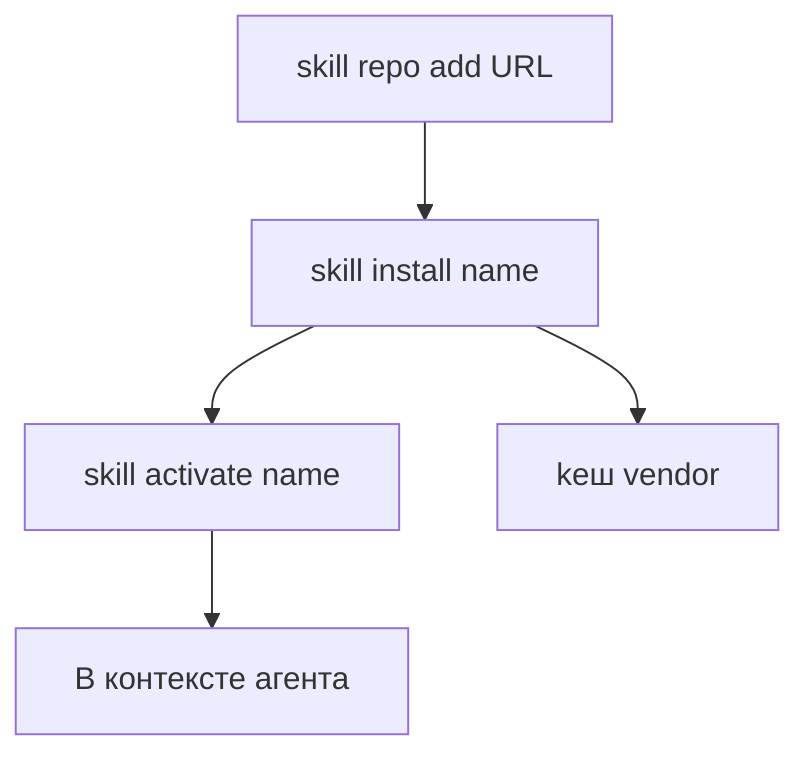

**Русский** | [English](../en/skill-ecosystem.md)

# Экосистема скиллов — карта на одной странице

Точка входа для **внешних / репозиторных** скиллов (не 12 core slash-скиллов + `/brain` conditional в `harness/skills/` — они в **[Навыки](skills.md)**).

## Поток (установка)

**Шаги CLI** (как в [CLI — Навыки](cli.md#навыки); вызов через `.tausik/tausik`):

1. **`skill repo add <url>`** — зарегистрировать repo с `tausik-skills.json` (или legacy `skills.json`).
2. **`skill install <name>`** — при необходимости clone, копирование, pip-зависимости.
3. **`skill activate <name>`** — подключить установленный скилл в путь загрузки IDE (три уровня: **[Vendor skills](vendor-skills.md)**).
4. **`skill list`** — активные, vendored и доступные из repo.

**Отключение / удаление:** `skill deactivate` · `skill uninstall` · `skill repo remove` — см. справочник CLI.

## Риски

- Без **`--force`** команда **`skill repo add`** принимает только официальный URL **Kibertum/tausik-skills**; для сторонних репо нужен явный opt-in после ревью ([Внешние скиллы — доверие к репо](vendor-skills.md#доверие-к-репо-force)).
- Внешние репозитории содержат **произвольные инструкции** в `SKILL.md` и могут запускать код при установке. Подробнее: **[Внешние скиллы](vendor-skills.md)**.
- **Бюджет контекста:** каждый *активный* скилл занимает место в промпте.

## Куда дальше

| Тема | Документ |
|------|----------|
| Формат репо, pip, `tausik-skills.json` | [Vendor skills](vendor-skills.md) |
| Core slash-скиллы | [Навыки](skills.md) |
| Пути под IDE | [Адаптация скиллов](skill-adaptation.md) |
| MCP `tausik_skill_*` | [MCP](mcp.md) |
